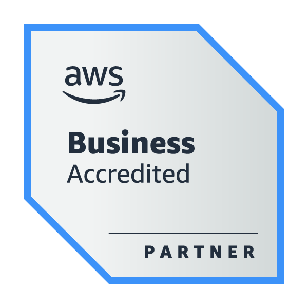
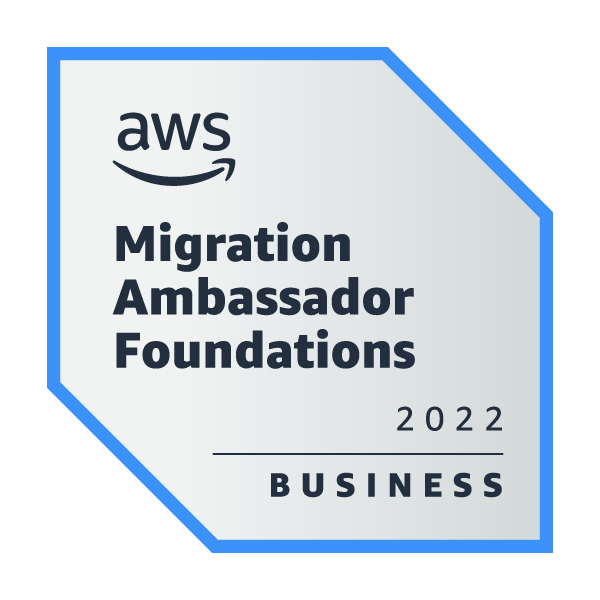
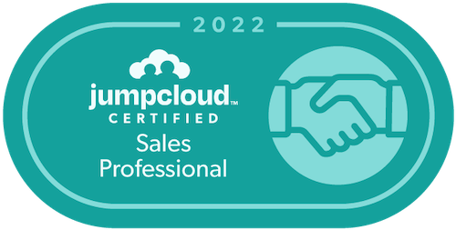

## Good Day! :sunny:

My name is Chanvit Moungyoo

- 😄 Pronouns: **Chan**
- Born on: 17 October 1999 in Samut Prakan, Thailand
- Graduated from Sirindhorn International Institute of Technology, Thammasat University
- 🔭 I am currently living in **Gaimersheim, Germany 🇩🇪**
- I am actively looking for a job in the cloud-related position
- Corporative Education: Ragnar Corporation Co., Ltd. from Jan 2022 - June 2022 (Cloud Infrastructure, CI and CD, Cloud Security)
- GZY Cloud Services Co., Ltd from June 2022 - September 2022 (Cloud Engineer)
- 🌱 I’m currently improving knowledge of Logs Management, Web Development, Public Cloud Platform, Network and Cyber Security
- ❔ Ask me about: Network Security, Cyber Attack and Cloud technology

## Certificate

### Amazon Web Services Training and Certification

    
 
* [Job Roles in the Cloud](Assets/AWS/AWS_Certificate_3.pdf)
* [AWS Cloud Practitioner Essentials](Assets/AWS/AWS_Certificate_4pdf.pdf)
* [AWS Partner Migration-Programs and Resources](Assets/AWS/AWS_Certificate_5.pdf)

<!-- * Job Roles in the Cloud -->
<!-- * AWS Cloud Practitioner Essentials
* AWS Partner Migration-Programs and Resources -->
### JumpCloud
 
 
 
 
## Programming Languages and Tools

 **Programming Languages**

      

 
 
 

**Tools**

 
 
 

 
 

## Cloud Provider

 
 

## Operating Systems

  

## Socials📱

Feel free to contact me:

